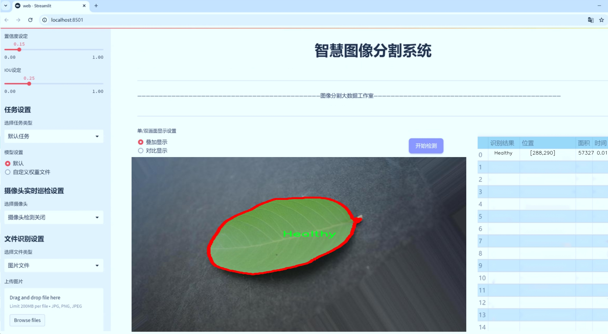
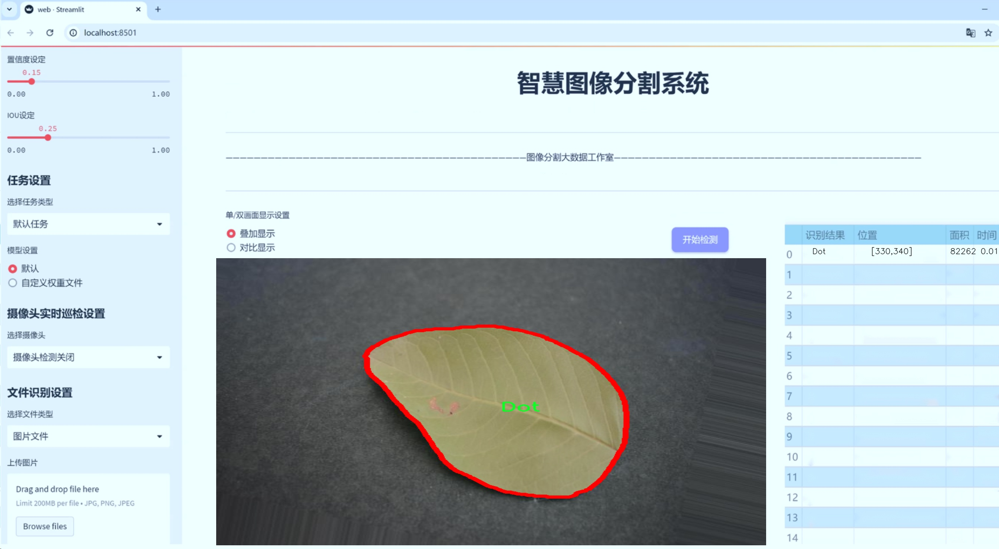
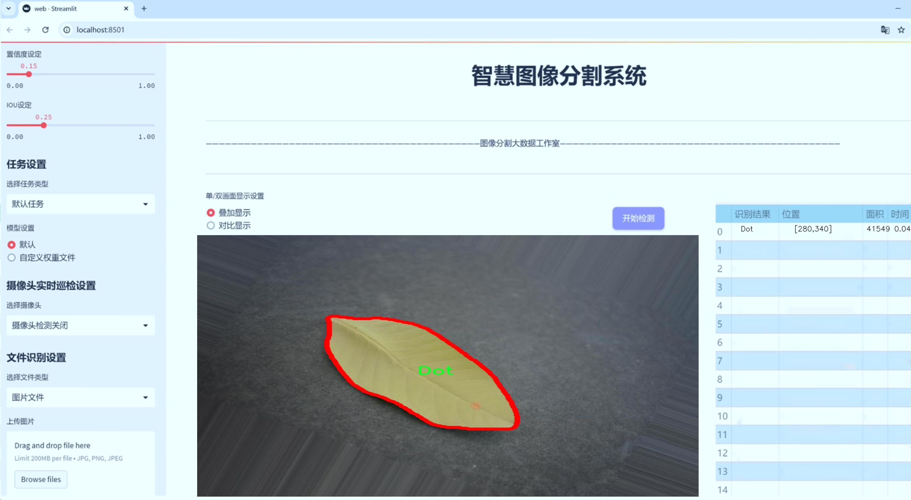
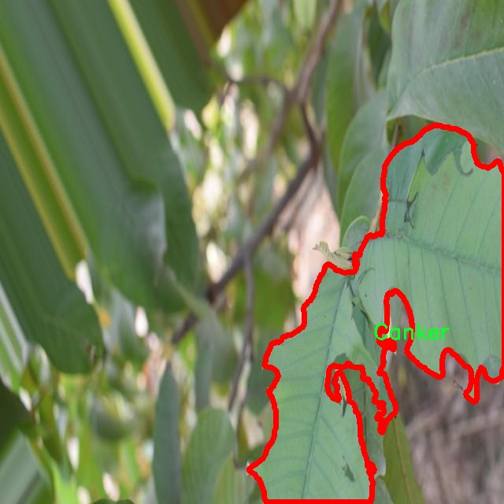
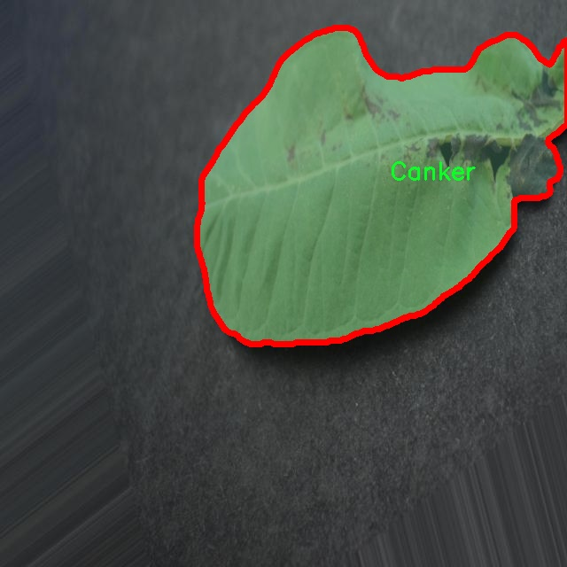
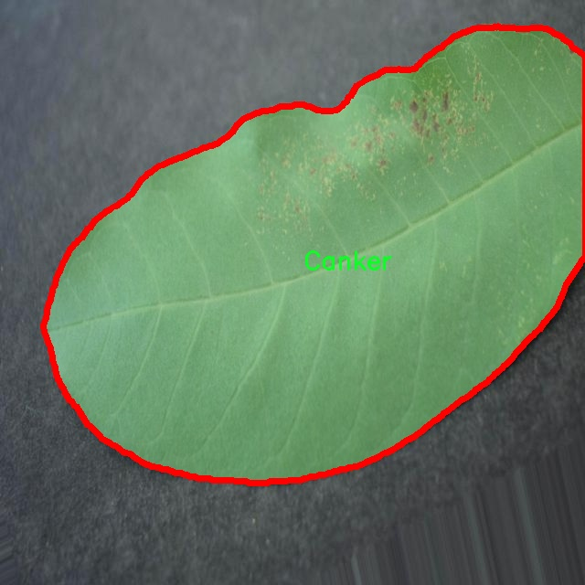
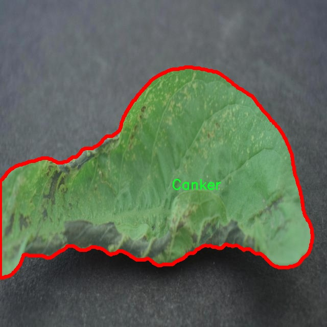
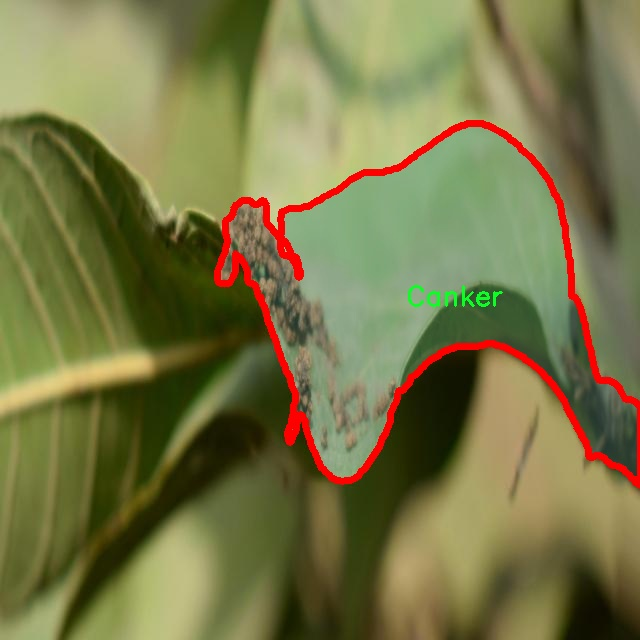

# 番石榴病害图像分割系统： yolov8-seg-dyhead-DCNV3

### 1.研究背景与意义

[参考博客](https://gitee.com/YOLOv8_YOLOv11_Segmentation_Studio/projects)

[博客来源](https://kdocs.cn/l/cszuIiCKVNis)

研究背景与意义

随着全球气候变化和农业生产方式的转变，植物病害的发生频率和范围不断增加，给农业生产带来了严峻的挑战。尤其是在热带和亚热带地区，番石榴作为一种重要的经济作物，其产量和品质受到多种病害的威胁。针对番石榴的病害进行有效的监测和管理，已成为提高农业生产效率和保障食品安全的重要课题。传统的病害识别方法往往依赖于人工观察，不仅耗时耗力，而且容易受到主观因素的影响，导致识别准确率低。因此，基于计算机视觉和深度学习技术的自动化病害检测与识别系统应运而生，成为当前研究的热点。

在众多深度学习模型中，YOLO（You Only Look Once）系列因其高效的实时目标检测能力而备受关注。YOLOv8作为该系列的最新版本，具备了更强的特征提取能力和更快的处理速度，适合用于复杂环境下的图像分割任务。然而，现有的YOLOv8模型在处理特定农业病害图像时，仍存在一定的局限性，如对小目标的检测精度不足、背景复杂情况下的误识别等。因此，针对番石榴病害图像的特征，改进YOLOv8模型以提升其在病害图像分割中的性能，具有重要的研究意义。

本研究所使用的数据集“Guava_Disease_segmentation”包含4300幅图像，涵盖了9种不同的类别，包括病害如Canker、Dot、Guava_disease、Mummification、Phytopthora、Rust、Scab、Styler_Root以及健康的番石榴。这一丰富的数据集为模型的训练和验证提供了坚实的基础，使得模型能够学习到不同病害的特征，从而实现更为精准的图像分割和识别。通过对这些数据的深入分析和处理，可以有效提升模型对不同病害的分辨能力，进而为农民提供更为科学的病害监测手段。

此外，基于改进YOLOv8的番石榴病害图像分割系统的研究，不仅具有理论价值，还具有广泛的应用前景。通过实现对番石榴病害的自动识别和分割，可以为农业生产提供实时监测和预警，帮助农民及时采取防治措施，降低病害对作物的影响。同时，该系统的研究成果也可以推广至其他经济作物的病害监测，为农业的智能化发展提供技术支持。

综上所述，基于改进YOLOv8的番石榴病害图像分割系统的研究，既是对深度学习技术在农业领域应用的探索，也是对提高农业生产效率和保障食品安全的重要贡献。通过本研究的深入开展，期望能够为番石榴病害的防治提供新的思路和方法，推动农业智能化的发展进程。

### 2.图片演示







注意：本项目提供完整的训练源码数据集和训练教程,由于此博客编辑较早,暂不提供权重文件（best.pt）,需要按照6.训练教程进行训练后实现上图效果。

### 3.视频演示

[3.1 视频演示](https://www.bilibili.com/video/BV1TbzcYnEAz/)

### 4.数据集信息

##### 4.1 数据集类别数＆类别名

nc: 8
names: ['Canker', 'Dot', 'Healthy', 'Mummification', 'Phytopthora', 'Rust', 'Scab', 'Styler_Root']


##### 4.2 数据集信息简介

数据集信息展示

在现代农业生产中，作物病害的及时识别与处理至关重要，尤其是在全球气候变化和病虫害频发的背景下，如何有效监测和管理作物健康成为了一个亟待解决的问题。为此，本研究引入了“Guava_Disease_segmentation”数据集，旨在为改进YOLOv8-seg的番石榴病害图像分割系统提供强有力的支持。该数据集专门针对番石榴的多种病害进行标注，包含了丰富的图像数据，能够帮助模型更好地学习和识别不同类型的病害特征。

“Guava_Disease_segmentation”数据集包含8个类别，具体包括：Canker（癌肿病）、Dot（点状病）、Healthy（健康）、Mummification（干枯病）、Phytopthora（根腐病）、Rust（锈病）、Scab（斑点病）和Styler_Root（根部病害）。这些类别涵盖了番石榴常见的病害类型，每种病害都有其独特的表现形式和生物学特征。通过对这些病害进行细致的标注，数据集为研究人员提供了一个多样化的样本库，使得模型在训练过程中能够接触到不同的病害表现，进而提高模型的泛化能力和准确性。

数据集中的图像样本均经过精心挑选和标注，确保每个类别的样本数量均衡，避免因样本不均而导致的模型偏倚。每个类别的图像都包含了不同生长阶段的番石榴，以模拟真实环境中可能遇到的各种情况。这种多样性不仅增强了数据集的代表性，也为模型的训练提供了更为丰富的特征信息，使得模型能够更好地适应实际应用场景。

在数据集的构建过程中，研究团队还特别关注了图像的质量和分辨率，确保所使用的图像在细节上能够清晰地展现病害特征。高质量的图像不仅有助于提高模型的训练效果，也为后续的病害检测和分类提供了可靠的基础。此外，数据集还包括了不同光照条件和背景环境下的图像，进一步增强了模型在复杂环境下的适应能力。

为了确保数据集的可用性和可扩展性，研究团队还计划定期更新数据集，增加新的样本和类别，以应对不断变化的病害形势和农业生产需求。这种动态更新机制将使得“Guava_Disease_segmentation”数据集在未来的研究中保持活力，成为持续推动番石榴病害识别技术进步的重要资源。

总之，“Guava_Disease_segmentation”数据集不仅为改进YOLOv8-seg的番石榴病害图像分割系统提供了坚实的基础，也为未来的农业智能化管理提供了重要的数据支持。通过对这一数据集的深入研究与应用，期望能够实现更高效的病害检测和精准的农业管理，助力可持续农业的发展。











### 5.项目依赖环境部署教程（零基础手把手教学）

[5.1 环境部署教程链接（零基础手把手教学）](https://www.bilibili.com/video/BV1jG4Ve4E9t/?vd_source=bc9aec86d164b67a7004b996143742dc)


[5.2 安装Python虚拟环境创建和依赖库安装视频教程链接（零基础手把手教学）](https://www.bilibili.com/video/BV1nA4VeYEze/?vd_source=bc9aec86d164b67a7004b996143742dc)

### 6.手把手YOLOV8-seg训练视频教程（零基础手把手教学）

[6.1 手把手YOLOV8-seg训练视频教程（零基础小白有手就能学会）](https://www.bilibili.com/video/BV1cA4VeYETe/?vd_source=bc9aec86d164b67a7004b996143742dc)


按照上面的训练视频教程链接加载项目提供的数据集，运行train.py即可开始训练



     Epoch   gpu_mem       box       obj       cls    labels  img_size
     1/200     0G   0.01576   0.01955  0.007536        22      1280: 100%|██████████| 849/849 [14:42<00:00,  1.04s/it]
               Class     Images     Labels          P          R     mAP@.5 mAP@.5:.95: 100%|██████████| 213/213 [01:14<00:00,  2.87it/s]
                 all       3395      17314      0.994      0.957      0.0957      0.0843

     Epoch   gpu_mem       box       obj       cls    labels  img_size
     2/200     0G   0.01578   0.01923  0.007006        22      1280: 100%|██████████| 849/849 [14:44<00:00,  1.04s/it]
               Class     Images     Labels          P          R     mAP@.5 mAP@.5:.95: 100%|██████████| 213/213 [01:12<00:00,  2.95it/s]
                 all       3395      17314      0.996      0.956      0.0957      0.0845

     Epoch   gpu_mem       box       obj       cls    labels  img_size
     3/200     0G   0.01561    0.0191  0.006895        27      1280: 100%|██████████| 849/849 [10:56<00:00,  1.29it/s]
               Class     Images     Labels          P          R     mAP@.5 mAP@.5:.95: 100%|███████   | 187/213 [00:52<00:00,  4.04it/s]
                 all       3395      17314      0.996      0.957      0.0957      0.0845


### 7.50+种全套YOLOV8-seg创新点加载调参实验视频教程（一键加载写好的改进模型的配置文件）

[7.1 50+种全套YOLOV8-seg创新点加载调参实验视频教程（一键加载写好的改进模型的配置文件）](https://www.bilibili.com/video/BV1Hw4VePEXv/?vd_source=bc9aec86d164b67a7004b996143742dc)

### YOLOV8-seg算法简介

原始YOLOV8-seg算法原理

YOLOv8-seg算法是YOLO系列模型中的最新版本，于2023年1月10日发布，代表了计算机视觉领域在目标检测和实例分割任务中的最新进展。该算法在多个方面进行了创新，旨在提高精度和执行效率，尤其是在实时应用场景中。YOLOv8-seg不仅延续了YOLO系列一贯的高效性，还在模型结构和功能上进行了显著的改进，成为了目标检测与实例分割的强大工具。

YOLOv8-seg的核心在于其全新的网络架构，这一架构结合了YOLOv5、YOLOv6和YOLOX等前代模型的优点，形成了一种更为高效的特征提取和处理机制。与以往版本相比，YOLOv8-seg采用了更深的卷积神经网络结构，允许模型在更复杂的特征空间中进行学习，从而提高了对小目标和高分辨率图像的检测能力。该模型的设计理念是通过改进的特征金字塔网络（PAN-FPN）和跨阶段局部网络（CSP）来实现更优的特征融合，进而提升整体的检测性能。

在YOLOv8-seg中，最显著的变化之一是其骨干网络的设计。相较于之前的版本，YOLOv8-seg的第一个卷积层的卷积核从6x6缩小至3x3，这一变化不仅减少了计算量，还使得特征提取更加精细。此外，YOLOv8-seg将C3模块替换为C2f模块，增加了更多的跳层连接和Split操作，这一设计的目的在于提高信息流动的效率，确保特征在不同层次间的有效传递。

YOLOv8-seg的头部结构同样经历了重大改进。原先的耦合头被解耦头所取代，且从传统的Anchor-Based检测方式转变为Anchor-Free的检测方式。这一转变不仅简化了模型的设计，还提高了对不同尺度目标的适应能力。YOLOv8-seg的解耦头将分类和回归任务分开处理，使得模型在进行目标检测时能够更为精准地定位目标，同时减少了计算复杂度。

在损失函数的设计上，YOLOv8-seg也进行了创新，旨在更好地优化模型的训练过程。通过引入新的损失函数，YOLOv8-seg能够在训练过程中更有效地调整权重，从而提高模型的收敛速度和最终的检测精度。这一改进使得YOLOv8-seg在多种数据集上的表现均优于以往的YOLO版本，尤其是在COCO数据集上，其平均精度（mAP）显著提升。

YOLOv8-seg的另一个重要特点是其对硬件平台的广泛支持。无论是在CPU还是GPU上，YOLOv8-seg都能够高效运行，极大地提升了其应用的灵活性。该模型不仅适用于传统的目标检测任务，还能够支持姿态评估、小目标检测等多种应用场景，进一步拓宽了其使用范围。

在实际应用中，YOLOv8-seg的表现同样令人瞩目。通过多尺度训练和测试，模型能够在不同的环境和条件下保持稳定的性能。尤其是在智能监控、自动驾驶和人脸识别等领域，YOLOv8-seg展现出了其卓越的检测能力和实时响应能力。与其他算法相比，YOLOv8-seg在精度和帧率上均有显著提升，使其成为当前业界最为流行和成功的目标检测与实例分割模型之一。

综上所述，YOLOv8-seg算法通过一系列结构性和功能性的创新，提升了目标检测和实例分割的性能。其新颖的骨干网络、解耦头结构以及优化的损失函数，使得YOLOv8-seg在处理复杂视觉任务时展现出更高的效率和准确性。这些改进不仅巩固了YOLO系列在计算机视觉领域的领导地位，也为未来的研究和应用提供了更为坚实的基础。随着YOLOv8-seg的推广和应用，预计将会在更多的实际场景中发挥重要作用，推动计算机视觉技术的进一步发展。


### 9.系统功能展示（检测对象为举例，实际内容以本项目数据集为准）

图9.1.系统支持检测结果表格显示

  图9.2.系统支持置信度和IOU阈值手动调节

  图9.3.系统支持自定义加载权重文件best.pt(需要你通过步骤5中训练获得)

  图9.4.系统支持摄像头实时识别

  图9.5.系统支持图片识别

  图9.6.系统支持视频识别

  图9.7.系统支持识别结果文件自动保存

  图9.8.系统支持Excel导出检测结果数据


### 10.50+种全套YOLOV8-seg创新点原理讲解（非科班也可以轻松写刊发刊，V11版本正在科研待更新）

#### 10.1 由于篇幅限制，每个创新点的具体原理讲解就不一一展开，具体见下列网址中的创新点对应子项目的技术原理博客网址【Blog】：


[10.1 50+种全套YOLOV8-seg创新点原理讲解链接](https://gitee.com/qunmasj/good)

#### 10.2 部分改进模块原理讲解(完整的改进原理见上图和技术博客链接)【如果此小节的图加载失败可以通过CSDN或者Github搜索该博客的标题访问原始博客，原始博客图片显示正常】
### YOLOv8简介
根据官方描述，Yolov8是一个SOTA模型，它建立在Yolo系列历史版本的基础上，并引入了新的功能和改进点，以进一步提升性能和灵活性，使其成为实现目标检测、图像分割、姿态估计等任务的最佳选择。其具体创新点包括一个新的骨干网络、一个新的Ancher-Free检测头和一个新的损失函数，可在CPU到GPU的多种硬件平台上运行。
此外，Yolov8还有一个特点就是可扩展性，ultralytics没有直接将开源库命名为Yolov8，而是直接使用"ultralytcs"，将其定位为算法框架，而非某一个特定算法。这也使得Yolov8开源库不仅仅能够用于Yolo系列模型，而且能够支持非Yolo模型以及分类分割姿态估计等各类任务。
总而言之，Yolov8是Yolo系列模型的最新王者，各种指标全面超越现有对象检测与实例分割模型，借鉴了Yolov5、Yolov6、YoloX等模型的设计优点，在全面提升改进Yolov5模型结构的基础上实现，同时保持了Yolov5工程化简洁易用的优势。

#### Yolov8创新点
Yolov8主要借鉴了Yolov5、Yolov6、YoloX等模型的设计优点，其本身创新点不多，偏重在工程实践上，具体创新如下:
·提供了一个全新的SOTA模型（包括P5 640和P6 1280分辨率的目标检测网络和基于YOLACT的实例分割模型)。并且，基于缩放系数提供了N/S/M/L/X不同尺度的模型，以满足不同部署平台和应用场景的需求。
. Backbone:同样借鉴了CSP模块思想，不过将Yolov5中的C3模块替换成了C2f模块
实现了进—步轻量化，同时沿用Yolov5中的
SPPF模块，并对不同尺度的模型进行精心微调，不再是无脑式一套参数用于所有模型，大幅提升了模型性能。
。Neck:继续使用PAN的思想，但是通过对比YOLOv5与YOLOv8的结构图可以看到，YOLOv8移除了1*1降采样层。
·Head部分相比YOLOv5改动较大，Yolov8换成了目前主流的解耦头结构(Decoupled-Head)，将分类和检测头分离，同时也从Anchor-Based换成了Anchor-Free。
·Loss计算:使用VFLLoss作为分类损失(实际训练中使用BCE Loss);使用DFLLoss+CIOU Loss作为回归损失。
。标签分配: Yolov8抛弃了以往的loU分配或者单边比例的分配方式，而是采用Task-Aligned Assigner正负样本分配策略。
#### Yolov8网络结构
Yolov8模型网络结构图如下图所示。


### Diverse Branch Block简介
参考该博客提出的一种通用的卷积网络构造块用来在不增加任何推理时间的前提下提升卷积网络的性能。我们将这个块命名为分离分支块（Diverse Branch Block）。通过结合不同尺寸和复杂度的分离分支（包括串联卷积、多尺度卷积和平均池化层）来增加特征空间的方法，它提升了单个卷积的表达能力。完成训练后，一个DBB(Diverse Branch Block)可以被等价地转换为一个单独的卷积操作以方便部署。不同于那些新颖的卷积结构的改进方式，DBB让训练时微结构复杂化同时维持大规模结构，因此我们可以将它作为任意结构中通用卷积层的一种嵌入式替代形式。通过这种方式，我们能够将模型训练到一个更高的表现水平，然后在推理时转换成原始推理时间的结构。

 
主要贡献点：

（1） 我们建议合并大量的微结构到不同的卷积结构中来提升性能，但是维持原始的宏观结构。

（2）我们提出DBB，一个通用构造块结构，概括六种转换来将一个DBB结构转化成一个单独卷积，因为对于用户来说它是无损的。

（3）我们提出一个Inception-like DBB结构实例(Fig 1)，并且展示它在ImageNet、COCO detection 和CityScapes任务中获得性能提升。


#### 结构重参数化
本文和一个并发网络RepVGG[1]是第一个使用结构重参数化来命名该思路------使用从其他结构转化来的参数确定当前结构的参数。一个之前的工作ACNet[2]也可以被划分为结构重参数化，它提出使用非对称卷积块来增强卷积核的结构（i.e 十字形结构）。相比于DBB，它被设计来提升卷积网络（在没有额外推理时间损失的条件下）。这个流水线也包含将一个训练好的模型转化为另一个。但是，ACNet和DBB的区别是：ACNet的思想被激发是基于一个观察，这个观察是网络结构的参数在过去有更大的量级，因此寻找方法让参数量级更大，然而我们关注一个不同的点。我们发现 平均池化、1x1 conv 和 1x1-kxk串联卷积是更有效的，因为它们提供了不同复杂度的路线，以及允许使用更多训练时非线性化。除此以外，ACB结构可以看作是DBB结构的一种特殊形式，因为那个1xk和kx1卷积层能够被扩大成kxk（via Transform VI(Fig.2)），然后合并成一个平方核（via Transform II）。

 

#### 分离分支结构
卷积的线性性
一个卷积操作可以表示为 ，其中为输入tensor, 为输出tensor。卷积核表示为一个四阶tensor , 偏置为。将加偏置的操作表示为。

因为，在第j个输出通道（h,w）位置的值可以由以下公式给出：，其中表示输入帧I的第c个通道上的一个滑动窗，对应输出帧O的坐标（h,w）。从上式可以看出，卷积操作具有齐次性和加法性。


注意：加法性成立的条件是两个卷积具有相同的配置（即通道数、核尺寸、步长和padding等）。

#### 分离分支的卷积
在这一小节，我们概括六种转换形式（Fig.2）来转换一个具有batch normalization(BN)、branch addition、depth concatenation、multi-scale operations、avarage pooling 和 sequences of convolutions的DBB分支。


Transform I：a conv for conv-BN  我们通常会给一个卷积配备配备一个BN层，它执行逐通道正则化和线性尺度放缩。设j为通道索引，分别为累积的逐通道均值和标准差，分别为学习的尺度因子和偏置项，对应输出通道j为


卷积的齐次性允许我们融合BN操作到前述的conv来做推理。在实践中，我们仅仅建立一个拥有卷积核和偏置, 用从原始BN序列的参数转换来的值来赋值。我们为每个输出通道j构造


Transform II a conv for branch addition  卷积的加法性确保如果有两个或者多个具有相同配置的卷积层相加，我们能够将它们合并到一个单独的卷积里面。对于conv-BN，我们应该首先执行Transform I。很明显的，通过下面的公式我们能够合并两个卷积


上述公式只有在两个卷积拥有相同配置时才成立。尽管合并上述分支能够在一定程度上增强模型，我们希望结合不同分支来进一步提升模型性能。在后面，我们介绍一些分支的形式，它们能够等价地被转化为一个单独的卷积。在通过多个转化来为每一个分支构造KxK的卷积之后，我们使用Transform II 将所有分支合并到一个conv里面。

Transform III: a conv for sequential convolutions   我们能够合并一个1x1 conv-BN-kxk conv序列到一个kxk conv里面。我们暂时假设卷积是稠密的（即 组数 groups=1）。组数groups>1的情形将会在Transform IV中实现。我们假定1x1和kxk卷积层的核形状分别是DxCx1x1和ExDxKxK，这里D指任意值。首先，我们将两个BN层融合到两个卷积层里面，由此获得。输出是


我们期望用一个单独卷积的核和偏置来表达，设, 它们满足。对方程（8）应用卷积的加法性，我们有


因为是一个1x1 conv，它只执行逐通道线性组合，没有空间聚合操作。通过线性重组KxK卷积核中的参数，我们能够将它合并到一个KxK的卷积核里面。容易证明的是，这样的转换可以由一个转置卷积实现：


其中是由转置获得的tensor张量。方程（10）的第二项是作用于常量矩阵上的卷积操作，因此它的输出也是一个常量矩阵。用表达式来说明，设是一个常数矩阵，其中的每个元素都等于p。*是一个2D 卷积操作，W为一个2D 卷积核。转换结果就是一个常量矩阵，这个常量矩阵是p 与 所有核元素之和 的乘积，即


基于以上观察，我们构造。然后，容易证明。

因此我们有

显而易见地，对于一个zero-pads 的KxK卷积，方程（8）并不成立，因为并不对的结果做卷积操作(如果有一个零元素的额外的圈，方程（8）成立)。解决方案有A)用padding配置第一个卷积，第二个卷积不用，B)通过做pad操作。后者的一个有效实现是定制第一个BN层，为了（1）如通常的batch-normalize输入。（2）计算(通过方程（6）)。（3）用  pad batch-normalized结果，例如 用一圈 pad 每一个通道j 。

Transform IV: a conv for depth concatenation  Inception 单元使用深度concatenation来组合不同分支。当每个分支都只包含一个相同配置的卷积时，深度concatenation等价于一个卷积，它的核在不同的输出通道上concatenation（比如我们公式中的第一个轴）假设。我们concatenate它们到。显然地


Transform IV 可以非常方便地将Transform III 扩展到 groupwise（即 groups > 1） 的情景。直觉上，一个groupwise 卷积将输入分割成g个并行的组，单独卷积它们，然后concatenate形成输出。为了代替g-group卷积，我们建立一个DBB结构，这个结构的所有卷积层有相同的组g。为了转换一个1x1-KxK序列，我们等价地分割它们成为g组，单独执行Transform III, 然后concatenate获得输出（如图Fig3所示）。


Transform V: a conv for average pooling  一个作用于C通道的核尺寸为K，步长为s的平均池化层等价于一个拥有相同核尺寸K,步长s的卷积层。这样的核可以被构造为

  


就像一个通常的平均池化操作，当s>1时执行降采样操作，当s=1时保持相同尺寸。

Transform VI: a conv for multi-scale convolutions   考虑一个等价于一个拥有相同zero padding的 核。特别地，卷积是格外实用的，因为它们能够有效实现。应该对输入作pad操作来对齐滑动窗。


### 11.项目核心源码讲解（再也不用担心看不懂代码逻辑）

#### 11.1 ultralytics\nn\backbone\convnextv2.py

以下是经过简化和注释的核心代码部分，主要包括 `LayerNorm`、`GRN`、`Block` 和 `ConvNeXtV2` 类，以及模型的构建和权重更新函数。

```python
import torch
import torch.nn as nn
import torch.nn.functional as F
from timm.models.layers import trunc_normal_, DropPath

class LayerNorm(nn.Module):
    """ 自定义的层归一化，支持两种数据格式：channels_last 和 channels_first """
    def __init__(self, normalized_shape, eps=1e-6, data_format="channels_last"):
        super().__init__()
        self.weight = nn.Parameter(torch.ones(normalized_shape))  # 归一化的权重
        self.bias = nn.Parameter(torch.zeros(normalized_shape))    # 归一化的偏置
        self.eps = eps
        self.data_format = data_format
        if self.data_format not in ["channels_last", "channels_first"]:
            raise NotImplementedError 
        self.normalized_shape = (normalized_shape, )
    
    def forward(self, x):
        # 根据数据格式进行层归一化
        if self.data_format == "channels_last":
            return F.layer_norm(x, self.normalized_shape, self.weight, self.bias, self.eps)
        elif self.data_format == "channels_first":
            u = x.mean(1, keepdim=True)  # 计算均值
            s = (x - u).pow(2).mean(1, keepdim=True)  # 计算方差
            x = (x - u) / torch.sqrt(s + self.eps)  # 标准化
            x = self.weight[:, None, None] * x + self.bias[:, None, None]  # 应用权重和偏置
            return x

class GRN(nn.Module):
    """ 全局响应归一化层 """
    def __init__(self, dim):
        super().__init__()
        self.gamma = nn.Parameter(torch.zeros(1, 1, 1, dim))  # 缩放参数
        self.beta = nn.Parameter(torch.zeros(1, 1, 1, dim))   # 偏置参数

    def forward(self, x):
        Gx = torch.norm(x, p=2, dim=(1,2), keepdim=True)  # 计算L2范数
        Nx = Gx / (Gx.mean(dim=-1, keepdim=True) + 1e-6)  # 归一化
        return self.gamma * (x * Nx) + self.beta + x  # 返回归一化后的结果

class Block(nn.Module):
    """ ConvNeXtV2 的基本块 """
    def __init__(self, dim, drop_path=0.):
        super().__init__()
        self.dwconv = nn.Conv2d(dim, dim, kernel_size=7, padding=3, groups=dim)  # 深度可分离卷积
        self.norm = LayerNorm(dim, eps=1e-6)  # 层归一化
        self.pwconv1 = nn.Linear(dim, 4 * dim)  # 1x1卷积（线性层）
        self.act = nn.GELU()  # 激活函数
        self.grn = GRN(4 * dim)  # 全局响应归一化
        self.pwconv2 = nn.Linear(4 * dim, dim)  # 1x1卷积（线性层）
        self.drop_path = DropPath(drop_path) if drop_path > 0. else nn.Identity()  # 随机深度

    def forward(self, x):
        input = x
        x = self.dwconv(x)  # 深度卷积
        x = x.permute(0, 2, 3, 1)  # 转换维度顺序
        x = self.norm(x)  # 归一化
        x = self.pwconv1(x)  # 1x1卷积
        x = self.act(x)  # 激活
        x = self.grn(x)  # 全局响应归一化
        x = self.pwconv2(x)  # 1x1卷积
        x = x.permute(0, 3, 1, 2)  # 恢复维度顺序

        x = input + self.drop_path(x)  # 残差连接
        return x

class ConvNeXtV2(nn.Module):
    """ ConvNeXt V2 模型 """
    def __init__(self, in_chans=3, num_classes=1000, 
                 depths=[3, 3, 9, 3], dims=[96, 192, 384, 768], 
                 drop_path_rate=0., head_init_scale=1.):
        super().__init__()
        self.depths = depths
        self.downsample_layers = nn.ModuleList()  # 下采样层
        # 构建stem层
        stem = nn.Sequential(
            nn.Conv2d(in_chans, dims[0], kernel_size=4, stride=4),
            LayerNorm(dims[0], eps=1e-6, data_format="channels_first")
        )
        self.downsample_layers.append(stem)
        # 构建下采样层
        for i in range(3):
            downsample_layer = nn.Sequential(
                    LayerNorm(dims[i], eps=1e-6, data_format="channels_first"),
                    nn.Conv2d(dims[i], dims[i+1], kernel_size=2, stride=2),
            )
            self.downsample_layers.append(downsample_layer)

        self.stages = nn.ModuleList()  # 特征分辨率阶段
        dp_rates = [x.item() for x in torch.linspace(0, drop_path_rate, sum(depths))] 
        cur = 0
        # 构建每个阶段的块
        for i in range(4):
            stage = nn.Sequential(
                *[Block(dim=dims[i], drop_path=dp_rates[cur + j]) for j in range(depths[i])]
            )
            self.stages.append(stage)
            cur += depths[i]

        self.norm = nn.LayerNorm(dims[-1], eps=1e-6)  # 最后的归一化层
        self.head = nn.Linear(dims[-1], num_classes)  # 分类头

        self.apply(self._init_weights)  # 初始化权重

    def _init_weights(self, m):
        """ 权重初始化 """
        if isinstance(m, (nn.Conv2d, nn.Linear)):
            trunc_normal_(m.weight, std=.02)  # 截断正态分布初始化权重
            nn.init.constant_(m.bias, 0)  # 偏置初始化为0

    def forward(self, x):
        """ 前向传播 """
        res = []
        for i in range(4):
            x = self.downsample_layers[i](x)  # 下采样
            x = self.stages[i](x)  # 特征提取
            res.append(x)  # 保存结果
        return res

def update_weight(model_dict, weight_dict):
    """ 更新模型权重 """
    idx, temp_dict = 0, {}
    for k, v in weight_dict.items():
        if k in model_dict.keys() and np.shape(model_dict[k]) == np.shape(v):
            temp_dict[k] = v  # 只更新匹配的权重
            idx += 1
    model_dict.update(temp_dict)  # 更新模型权重
    print(f'loading weights... {idx}/{len(model_dict)} items')
    return model_dict
```

### 代码说明
1. **LayerNorm**: 自定义的层归一化类，支持不同的输入格式。
2. **GRN**: 全局响应归一化层，用于增强特征表示。
3. **Block**: ConvNeXtV2的基本构建块，包含深度卷积、归一化、激活、全局响应归一化和残差连接。
4. **ConvNeXtV2**: 主模型类，构建了下采样层和多个特征提取阶段。
5. **update_weight**: 更新模型权重的函数，只保留匹配的权重。

这个文件定义了一个名为 `ConvNeXtV2` 的深度学习模型，主要用于图像分类任务。该模型是基于 ConvNeXt 架构的改进版本，结合了多种现代深度学习技术，如层归一化、全局响应归一化等。以下是对文件中各个部分的详细说明。

首先，文件引入了必要的库，包括 PyTorch 的核心模块和一些用于模型构建的工具。`LayerNorm` 类实现了层归一化功能，支持两种数据格式：`channels_last` 和 `channels_first`。这种灵活性使得模型可以适应不同的输入格式。`forward` 方法根据输入数据的格式选择相应的归一化方式。

接下来，`GRN` 类实现了全局响应归一化层，它通过计算输入张量的 L2 范数来进行归一化处理，并通过可学习的参数 `gamma` 和 `beta` 来调整输出。这种归一化方法可以帮助模型更好地学习。

`Block` 类定义了 ConvNeXtV2 的基本构建块。每个块包含一个深度可分离卷积层、层归一化、点卷积、激活函数（GELU）和全局响应归一化层。通过使用残差连接和随机深度（Drop Path）技术，模型可以在训练过程中更好地学习和泛化。

`ConvNeXtV2` 类是整个模型的核心部分。它接受输入通道数、分类头的类别数、每个阶段的块数、特征维度、随机深度率等参数。模型的构建包括一个初始的卷积层和多个下采样层，以及多个特征分辨率阶段，每个阶段由多个 `Block` 组成。最后，模型还包含一个归一化层和一个线性分类头。

在模型的初始化过程中，使用了 `trunc_normal_` 函数对卷积层和线性层的权重进行初始化，并将偏置初始化为零。`forward` 方法通过下采样层和各个阶段的块逐步处理输入数据，并将每个阶段的输出保存在 `res` 列表中。

此外，文件还定义了一些函数，用于创建不同规模的 ConvNeXtV2 模型（如 `convnextv2_atto`、`convnextv2_femto` 等）。这些函数允许用户根据需要加载预训练权重，并根据指定的参数构建相应的模型。

最后，`update_weight` 函数用于更新模型的权重，确保加载的权重与模型的结构相匹配。通过这些函数，用户可以方便地使用不同规模的 ConvNeXtV2 模型进行图像分类任务。

总体而言，这个文件实现了一个灵活且高效的图像分类模型，结合了多种现代深度学习技术，适用于各种计算机视觉任务。

#### 11.2 ultralytics\models\sam\modules\transformer.py

以下是代码中最核心的部分，并附上详细的中文注释：

```python
import math
import torch
from torch import Tensor, nn

class Attention(nn.Module):
    """一个注意力层，允许在投影到查询、键和值之后对嵌入的大小进行下采样。"""

    def __init__(self, embedding_dim: int, num_heads: int, downsample_rate: int = 1) -> None:
        """
        初始化注意力模型，设置给定的维度和参数。

        Args:
            embedding_dim (int): 输入嵌入的维度。
            num_heads (int): 注意力头的数量。
            downsample_rate (int, optional): 内部维度下采样的因子，默认为1。
        """
        super().__init__()
        self.embedding_dim = embedding_dim  # 嵌入的维度
        self.internal_dim = embedding_dim // downsample_rate  # 内部维度
        self.num_heads = num_heads  # 注意力头的数量
        assert self.internal_dim % num_heads == 0, 'num_heads must divide embedding_dim.'  # 确保头数可以整除内部维度

        # 定义线性层用于查询、键和值的投影
        self.q_proj = nn.Linear(embedding_dim, self.internal_dim)
        self.k_proj = nn.Linear(embedding_dim, self.internal_dim)
        self.v_proj = nn.Linear(embedding_dim, self.internal_dim)
        self.out_proj = nn.Linear(self.internal_dim, embedding_dim)  # 输出层

    @staticmethod
    def _separate_heads(x: Tensor, num_heads: int) -> Tensor:
        """将输入张量分离成指定数量的注意力头。"""
        b, n, c = x.shape  # b: 批量大小, n: 序列长度, c: 嵌入维度
        x = x.reshape(b, n, num_heads, c // num_heads)  # 重塑为 B x N x N_heads x C_per_head
        return x.transpose(1, 2)  # 转置为 B x N_heads x N_tokens x C_per_head

    @staticmethod
    def _recombine_heads(x: Tensor) -> Tensor:
        """将分离的注意力头重新组合成一个张量。"""
        b, n_heads, n_tokens, c_per_head = x.shape  # 获取形状信息
        x = x.transpose(1, 2)  # 转置为 B x N_tokens x N_heads x C_per_head
        return x.reshape(b, n_tokens, n_heads * c_per_head)  # 重塑为 B x N_tokens x C

    def forward(self, q: Tensor, k: Tensor, v: Tensor) -> Tensor:
        """给定输入的查询、键和值张量，计算注意力输出。"""

        # 输入投影
        q = self.q_proj(q)  # 投影查询
        k = self.k_proj(k)  # 投影键
        v = self.v_proj(v)  # 投影值

        # 分离成多个头
        q = self._separate_heads(q, self.num_heads)
        k = self._separate_heads(k, self.num_heads)
        v = self._separate_heads(v, self.num_heads)

        # 计算注意力
        _, _, _, c_per_head = q.shape  # 获取每个头的维度
        attn = q @ k.permute(0, 1, 3, 2)  # 计算注意力得分
        attn = attn / math.sqrt(c_per_head)  # 缩放
        attn = torch.softmax(attn, dim=-1)  # 应用softmax获得注意力权重

        # 获取输出
        out = attn @ v  # 计算输出
        out = self._recombine_heads(out)  # 重新组合头
        return self.out_proj(out)  # 通过输出层
```

### 代码核心部分解释：
1. **Attention类**：实现了一个注意力机制，支持将输入嵌入的维度进行下采样。它包括查询、键和值的线性投影，以及分离和重新组合注意力头的功能。
2. **初始化方法**：定义了输入嵌入的维度、注意力头的数量以及下采样率，并确保头的数量可以整除内部维度。
3. **_separate_heads和_recombine_heads方法**：这两个静态方法用于将输入张量分离成多个注意力头，以及将这些头重新组合为一个张量。
4. **forward方法**：实现了注意力计算的核心逻辑，包括查询、键和值的投影、注意力得分的计算、应用softmax以获得注意力权重，以及最终的输出计算。

这个程序文件定义了一个名为 `TwoWayTransformer` 的类，它是一个双向变换器模块，旨在同时关注图像和查询点。这个类是一个专门的变换器解码器，能够利用提供的查询位置嵌入来关注输入图像。这种设计特别适用于物体检测、图像分割和点云处理等任务。

在 `TwoWayTransformer` 类的构造函数中，定义了一些属性，包括变换器的层数（`depth`）、输入嵌入的通道维度（`embedding_dim`）、多头注意力的头数（`num_heads`）、MLP块的内部通道维度（`mlp_dim`）等。构造函数还初始化了一个模块列表 `layers`，用于存储多个 `TwoWayAttentionBlock` 层。在循环中，逐层添加这些注意力块，最后添加一个最终的注意力层和层归一化。

`forward` 方法接收三个输入：图像嵌入、图像的位置编码和点的嵌入。它首先将图像嵌入和位置编码展平并重新排列，以便后续处理。然后，准备查询和键，依次通过每个注意力层进行处理。最后，应用最终的注意力层并进行层归一化，返回处理后的查询和键。

`TwoWayAttentionBlock` 类实现了一个注意力块，能够在两个方向上执行自注意力和交叉注意力。这个块由四个主要层组成：对稀疏输入的自注意力、稀疏输入对密集输入的交叉注意力、对稀疏输入的MLP块以及密集输入对稀疏输入的交叉注意力。构造函数中定义了这些层的属性，并初始化相应的注意力和归一化层。

在 `TwoWayAttentionBlock` 的 `forward` 方法中，首先应用自注意力，然后是稀疏输入对密集输入的交叉注意力，接着是MLP块，最后是密集输入对稀疏输入的交叉注意力。每一步后都进行了层归一化，以确保稳定性和性能。

`Attention` 类实现了一个注意力层，允许在投影到查询、键和值之后对嵌入的大小进行下采样。构造函数中定义了输入嵌入的维度、注意力头的数量以及下采样率。该类还包括一些静态方法，用于将输入张量分离成多个注意力头，以及将分离的头重新组合成单个张量。

在 `Attention` 的 `forward` 方法中，首先对输入进行投影，然后将其分离成多个头。接着计算注意力权重，并通过对值的加权求和得到输出，最后将输出重新组合并通过输出投影层返回结果。

整体而言，这个程序文件实现了一个复杂的双向变换器架构，能够有效地处理图像和查询点之间的关系，适用于多种计算机视觉任务。

#### 11.3 ultralytics\models\rtdetr\__init__.py

以下是代码中最核心的部分，并附上详细的中文注释：

```python
# 导入必要的模块和类
from .model import RTDETR  # 从当前包中导入 RTDETR 模型类
from .predict import RTDETRPredictor  # 从当前包中导入 RTDETR 预测器类
from .val import RTDETRValidator  # 从当前包中导入 RTDETR 验证器类

# 定义模块的公开接口，指定可以被外部访问的类
__all__ = 'RTDETRPredictor', 'RTDETRValidator', 'RTDETR'
```

### 注释说明：
1. **导入模块**：
   - `from .model import RTDETR`：从当前包的 `model` 模块中导入 `RTDETR` 类，这个类通常是用于定义模型的结构和参数。
   - `from .predict import RTDETRPredictor`：从当前包的 `predict` 模块中导入 `RTDETRPredictor` 类，这个类负责使用模型进行预测。
   - `from .val import RTDETRValidator`：从当前包的 `val` 模块中导入 `RTDETRValidator` 类，这个类用于验证模型的性能和准确性。

2. **定义公开接口**：
   - `__all__` 是一个特殊的变量，用于定义当前模块的公共接口。只有在 `from module import *` 时，列出的类和函数才会被导入。这里列出了 `RTDETRPredictor`、`RTDETRValidator` 和 `RTDETR`，表示这些是该模块对外提供的主要功能。

这个程序文件是一个Python模块的初始化文件，文件名为`__init__.py`，位于`ultralytics\models\rtdetr`目录下。该文件的主要作用是定义模块的公共接口，并导入该模块中其他重要的类或函数。

首先，文件开头的注释`# Ultralytics YOLO 🚀, AGPL-3.0 license`表明该模块属于Ultralytics的YOLO项目，并且遵循AGPL-3.0许可证。这意味着该代码是开源的，用户可以自由使用和修改，但需要遵循相应的许可证条款。

接下来，文件通过`from .model import RTDETR`导入了`model`模块中的`RTDETR`类。这个类可能是实现了某种检测算法或模型的核心部分，具体功能需要查看`model.py`文件。

然后，文件通过`from .predict import RTDETRPredictor`导入了`predict`模块中的`RTDETRPredictor`类。这个类可能负责使用`RTDETR`模型进行预测，处理输入数据并输出结果。

接着，文件通过`from .val import RTDETRValidator`导入了`val`模块中的`RTDETRValidator`类。这个类可能用于验证模型的性能，评估其在特定数据集上的表现。

最后，`__all__`变量被定义为一个元组，包含了`RTDETRPredictor`、`RTDETRValidator`和`RTDETR`这三个名称。这意味着当使用`from ultralytics.models.rtdetr import *`语句时，只会导入这三个名称，其他未列出的名称将不会被导入。这是一种控制模块导出内容的方式，确保用户只访问到模块的公共接口，而不是内部实现细节。

总体而言，这个文件是`ultralytics.models.rtdetr`模块的入口，负责组织和导出与RTDETR相关的功能，使得用户可以方便地使用这些功能。

#### 11.4 ultralytics\utils\instance.py

以下是经过简化和注释的核心代码部分，主要集中在 `Bboxes` 和 `Instances` 类的实现上：

```python
import numpy as np

class Bboxes:
    """
    处理边界框的类，支持多种格式（'xyxy', 'xywh', 'ltwh'）。
    属性:
        bboxes (numpy.ndarray): 存储边界框的二维数组。
        format (str): 边界框的格式（'xyxy', 'xywh', 或 'ltwh'）。
    """

    def __init__(self, bboxes, format='xyxy') -> None:
        """初始化 Bboxes 类，设置边界框数据和格式。"""
        assert format in ['xyxy', 'xywh', 'ltwh'], f'无效的边界框格式: {format}'
        bboxes = bboxes[None, :] if bboxes.ndim == 1 else bboxes  # 如果是1D数组，转为2D
        assert bboxes.ndim == 2 and bboxes.shape[1] == 4, '边界框必须是二维数组，且每个框有4个坐标'
        self.bboxes = bboxes
        self.format = format

    def convert(self, format):
        """将边界框格式转换为指定格式。"""
        assert format in ['xyxy', 'xywh', 'ltwh'], f'无效的边界框格式: {format}'
        if self.format == format:
            return  # 如果格式相同，不需要转换
        # 根据当前格式和目标格式选择转换函数
        func = {
            'xyxy': {'xywh': xyxy2xywh, 'ltwh': xyxy2ltwh},
            'xywh': {'xyxy': xywh2xyxy, 'ltwh': xywh2ltwh},
            'ltwh': {'xyxy': ltwh2xyxy, 'xywh': ltwh2xywh}
        }[self.format][format]
        self.bboxes = func(self.bboxes)  # 执行转换
        self.format = format  # 更新格式

    def areas(self):
        """返回每个边界框的面积。"""
        self.convert('xyxy')  # 确保转换为 'xyxy' 格式
        return (self.bboxes[:, 2] - self.bboxes[:, 0]) * (self.bboxes[:, 3] - self.bboxes[:, 1])  # 计算面积

    def __len__(self):
        """返回边界框的数量。"""
        return len(self.bboxes)

class Instances:
    """
    存储图像中检测到的对象的边界框、分段和关键点的容器。
    属性:
        _bboxes (Bboxes): 内部用于处理边界框操作的对象。
        keypoints (ndarray): 关键点数组，形状为 [N, 17, 3]。
        segments (ndarray): 分段数组，形状为 [N, 1000, 2]。
    """

    def __init__(self, bboxes, segments=None, keypoints=None, bbox_format='xywh', normalized=True) -> None:
        """初始化 Instances 类，设置边界框、分段和关键点数据。"""
        self._bboxes = Bboxes(bboxes=bboxes, format=bbox_format)  # 初始化边界框
        self.keypoints = keypoints
        self.normalized = normalized
        # 处理分段数据
        if segments is None:
            segments = []
        if len(segments) > 0:
            segments = resample_segments(segments)  # 重新采样分段
            segments = np.stack(segments, axis=0)  # 转为3D数组
        else:
            segments = np.zeros((0, 1000, 2), dtype=np.float32)  # 默认分段为空
        self.segments = segments

    def convert_bbox(self, format):
        """转换边界框格式。"""
        self._bboxes.convert(format=format)

    @property
    def bbox_areas(self):
        """计算边界框的面积。"""
        return self._bboxes.areas()

    def __getitem__(self, index) -> 'Instances':
        """
        使用索引获取特定实例或一组实例。
        返回:
            Instances: 包含选定边界框、分段和关键点的新 Instances 对象。
        """
        segments = self.segments[index] if len(self.segments) else self.segments
        keypoints = self.keypoints[index] if self.keypoints is not None else None
        bboxes = self._bboxes[index]
        bbox_format = self._bboxes.format
        return Instances(
            bboxes=bboxes,
            segments=segments,
            keypoints=keypoints,
            bbox_format=bbox_format,
            normalized=self.normalized,
        )

    def __len__(self):
        """返回实例的数量。"""
        return len(self._bboxes)
```

### 代码注释说明：
1. **Bboxes 类**：用于处理边界框，支持不同的格式（`xyxy`, `xywh`, `ltwh`）。包含初始化、格式转换、面积计算等方法。
2. **Instances 类**：用于存储图像中检测到的对象的边界框、分段和关键点。包含初始化、格式转换、索引获取等方法。
3. **属性和方法**：每个类的属性和方法都有详细的注释，说明其功能和用途。

这个程序文件是用于处理目标检测中的边界框（bounding boxes）和相关数据的，主要包含两个类：`Bboxes`和`Instances`。`Bboxes`类用于管理和转换不同格式的边界框，而`Instances`类则用于存储和处理图像中检测到的对象的边界框、分割和关键点。

首先，`Bboxes`类支持三种边界框格式：`xyxy`（左上角和右下角坐标）、`xywh`（中心坐标和宽高）以及`ltwh`（左上角坐标和宽高）。在初始化时，`Bboxes`类会检查输入的边界框格式是否有效，并确保输入的边界框数据是一个二维的NumPy数组。类中提供了多个方法来转换边界框格式、计算面积、缩放和偏移边界框等。

`Bboxes`类的`convert`方法允许用户将边界框从一种格式转换为另一种格式，`areas`方法则计算所有边界框的面积。`mul`和`add`方法分别用于按比例缩放和添加偏移量到边界框的坐标。类还实现了索引操作，使得用户可以方便地获取特定的边界框。

接下来是`Instances`类，它是一个容器，存储了边界框、分割和关键点等信息。`Instances`类的构造函数接受边界框、分割和关键点数据，并初始化内部的`Bboxes`对象。类中提供了多种方法来转换边界框格式、缩放、归一化和去归一化边界框、分割和关键点的坐标。

`Instances`类还实现了对边界框、分割和关键点的翻转、裁剪和去除零面积框的功能。它支持通过索引获取特定的实例，并提供了合并多个`Instances`对象的方法，以便于处理批量数据。

总体来说，这个文件提供了一整套用于处理目标检测中边界框及其相关数据的工具，便于用户在不同的格式之间进行转换和操作，同时也为后续的目标检测任务提供了基础数据结构。

#### 11.5 ultralytics\models\sam\modules\tiny_encoder.py

以下是代码中最核心的部分，并附上详细的中文注释：

```python
import torch
import torch.nn as nn
import torch.nn.functional as F

class Conv2d_BN(torch.nn.Sequential):
    """一个顺序容器，执行2D卷积操作，后接批量归一化。"""

    def __init__(self, in_channels, out_channels, kernel_size=1, stride=1, padding=0, dilation=1, groups=1, bn_weight_init=1):
        """初始化卷积层和批量归一化层。"""
        super().__init__()
        # 添加卷积层
        self.add_module('c', torch.nn.Conv2d(in_channels, out_channels, kernel_size, stride, padding, dilation, groups, bias=False))
        # 添加批量归一化层
        bn = torch.nn.BatchNorm2d(out_channels)
        # 初始化批量归一化层的权重和偏置
        torch.nn.init.constant_(bn.weight, bn_weight_init)
        torch.nn.init.constant_(bn.bias, 0)
        self.add_module('bn', bn)

class PatchEmbed(nn.Module):
    """将图像嵌入为补丁，并将其投影到指定的嵌入维度。"""

    def __init__(self, in_chans, embed_dim, resolution, activation):
        """初始化PatchEmbed类，指定输入通道、嵌入维度、分辨率和激活函数。"""
        super().__init__()
        img_size = (resolution, resolution)  # 假设输入图像为正方形
        self.patches_resolution = (img_size[0] // 4, img_size[1] // 4)  # 每个补丁的分辨率
        self.in_chans = in_chans
        self.embed_dim = embed_dim
        n = embed_dim
        # 定义卷积和激活序列
        self.seq = nn.Sequential(
            Conv2d_BN(in_chans, n // 2, 3, 2, 1),  # 第一个卷积层
            activation(),  # 激活函数
            Conv2d_BN(n // 2, n, 3, 2, 1),  # 第二个卷积层
        )

    def forward(self, x):
        """将输入张量通过PatchEmbed模型的序列操作。"""
        return self.seq(x)

class Attention(nn.Module):
    """多头注意力模块，支持空间感知。"""

    def __init__(self, dim, key_dim, num_heads=8, attn_ratio=4, resolution=(14, 14)):
        """初始化注意力模块。"""
        super().__init__()
        self.num_heads = num_heads
        self.scale = key_dim ** -0.5  # 缩放因子
        self.key_dim = key_dim
        self.attn_ratio = attn_ratio
        self.norm = nn.LayerNorm(dim)  # 层归一化
        self.qkv = nn.Linear(dim, dim * 3)  # 线性层用于生成查询、键、值
        self.proj = nn.Linear(dim, dim)  # 输出投影层

    def forward(self, x):
        """执行前向传播，通过归一化和查询键/值。"""
        B, N, _ = x.shape  # B: 批量大小, N: 序列长度
        x = self.norm(x)  # 归一化
        qkv = self.qkv(x)  # 生成查询、键、值
        q, k, v = qkv.view(B, N, 3, self.num_heads, -1).unbind(2)  # 分离查询、键、值
        attn = (q @ k.transpose(-2, -1)) * self.scale  # 计算注意力得分
        attn = attn.softmax(dim=-1)  # 应用softmax
        x = (attn @ v)  # 加权求和
        return self.proj(x)  # 输出投影

class TinyViT(nn.Module):
    """TinyViT架构，用于视觉任务。"""

    def __init__(self, img_size=224, in_chans=3, num_classes=1000, embed_dims=[96, 192, 384, 768], depths=[2, 2, 6, 2], num_heads=[3, 6, 12, 24]):
        """初始化TinyViT模型。"""
        super().__init__()
        self.img_size = img_size
        self.num_classes = num_classes
        self.depths = depths
        self.layers = nn.ModuleList()  # 存储每一层

        # 构建每一层
        for i_layer in range(len(depths)):
            layer = BasicLayer(dim=embed_dims[i_layer], depth=depths[i_layer], num_heads=num_heads[i_layer])
            self.layers.append(layer)

        # 分类头
        self.head = nn.Linear(embed_dims[-1], num_classes) if num_classes > 0 else nn.Identity()

    def forward(self, x):
        """执行前向传播，经过所有层并返回输出。"""
        for layer in self.layers:
            x = layer(x)  # 逐层处理输入
        return self.head(x)  # 通过分类头输出最终结果
```

### 代码说明：
1. **Conv2d_BN**：定义了一个包含卷积和批量归一化的顺序模块，常用于卷积神经网络中。
2. **PatchEmbed**：将输入图像分割成补丁并嵌入到指定的维度，主要用于处理图像数据。
3. **Attention**：实现了多头注意力机制，能够在输入特征中捕捉到不同位置之间的关系。
4. **TinyViT**：构建了TinyViT模型的主要框架，包含多个层次的结构，每一层都可以包含多个TinyViT块，最终通过一个线性层进行分类。

这些类和方法构成了TinyViT模型的核心部分，负责图像的处理和特征提取。

这个文件实现了一个名为TinyViT的视觉模型架构，主要用于图像分类等视觉任务。TinyViT结合了卷积神经网络（CNN）和变换器（Transformer）的优点，采用了一系列模块来处理输入图像并提取特征。

首先，文件导入了一些必要的库，包括PyTorch的核心模块和一些工具函数。接着，定义了一些基础组件，如卷积层、批归一化层、图像嵌入层（PatchEmbed）、移动反向瓶颈卷积（MBConv）层等。这些组件是构建TinyViT模型的基础。

在PatchEmbed类中，输入图像被分割成小块，并通过卷积层映射到指定的嵌入维度。MBConv类实现了高效的卷积操作，适用于移动设备，包含多个卷积和激活函数的组合。PatchMerging类则用于合并相邻的特征块，并将其投影到新的维度。

ConvLayer类实现了多个MBConv层的堆叠，支持下采样和梯度检查点功能，以节省内存。Mlp类实现了多层感知机（MLP），用于特征的进一步处理。Attention类实现了多头注意力机制，支持空间感知，能够根据输入特征的空间分布动态调整注意力。

TinyViTBlock类是TinyViT的基本构建块，结合了自注意力机制和局部卷积。BasicLayer类则用于构建TinyViT的一个基本层，包含多个TinyViTBlock，并支持下采样。

LayerNorm2d类实现了二维的层归一化，用于对特征进行标准化。最后，TinyViT类整合了所有组件，定义了模型的整体结构，包括输入图像的大小、通道数、分类数量、嵌入维度、深度、注意力头数等超参数。

TinyViT模型的构建过程包括初始化各个层、设置学习率衰减、权重初始化等。在前向传播过程中，输入图像经过嵌入层、多个基本层和最终的分类头，输出分类结果。

总的来说，这个文件实现了一个高效的视觉模型TinyViT，适用于各种视觉任务，具有灵活的结构和强大的特征提取能力。

### 12.系统整体结构（节选）

### 整体功能和构架概括

Ultralytics的代码库主要用于计算机视觉任务，特别是目标检测和图像分类。整个架构由多个模块组成，每个模块负责特定的功能。这些模块结合了现代深度学习技术，如卷积神经网络（CNN）、变换器（Transformer）和注意力机制，以实现高效的特征提取和处理。

- **`convnextv2.py`**：实现了ConvNeXtV2模型，专注于图像分类，结合了深度可分离卷积和现代归一化技术。
- **`transformer.py`**：定义了双向变换器模块，能够同时处理图像和查询点，适用于物体检测和图像分割任务。
- **`__init__.py`**：模块的初始化文件，导入和组织与RTDETR相关的类和功能，提供统一的接口。
- **`instance.py`**：提供了处理边界框和实例数据的工具，支持目标检测中的边界框格式转换和管理。
- **`tiny_encoder.py`**：实现了TinyViT模型架构，结合了卷积和变换器的优点，适用于图像分类等视觉任务。

### 文件功能整理表

| 文件路径                                      | 功能描述                                                                 |
|-------------------------------------------|-----------------------------------------------------------------------|
| `ultralytics/nn/backbone/convnextv2.py` | 实现ConvNeXtV2模型，主要用于图像分类，结合深度可分离卷积和现代归一化技术。  |
| `ultralytics/models/sam/modules/transformer.py` | 定义双向变换器模块，处理图像和查询点，适用于物体检测和图像分割任务。         |
| `ultralytics/models/rtdetr/__init__.py` | 模块初始化文件，导入与RTDETR相关的类和功能，提供统一的接口。                |
| `ultralytics/utils/instance.py`         | 提供处理边界框和实例数据的工具，支持边界框格式转换和管理。                  |
| `ultralytics/models/sam/modules/tiny_encoder.py` | 实现TinyViT模型架构，结合卷积和变换器的优点，适用于图像分类等视觉任务。      |

这个表格清晰地展示了每个文件的功能，便于理解整个代码库的结构和用途。

### 13.图片、视频、摄像头图像分割Demo(去除WebUI)代码

在这个博客小节中，我们将讨论如何在不使用WebUI的情况下，实现图像分割模型的使用。本项目代码已经优化整合，方便用户将分割功能嵌入自己的项目中。
核心功能包括图片、视频、摄像头图像的分割，ROI区域的轮廓提取、类别分类、周长计算、面积计算、圆度计算以及颜色提取等。
这些功能提供了良好的二次开发基础。

### 核心代码解读

以下是主要代码片段，我们会为每一块代码进行详细的批注解释：

```python
import random
import cv2
import numpy as np
from PIL import ImageFont, ImageDraw, Image
from hashlib import md5
from model import Web_Detector
from chinese_name_list import Label_list

# 根据名称生成颜色
def generate_color_based_on_name(name):
    ......

# 计算多边形面积
def calculate_polygon_area(points):
    return cv2.contourArea(points.astype(np.float32))

...
# 绘制中文标签
def draw_with_chinese(image, text, position, font_size=20, color=(255, 0, 0)):
    image_pil = Image.fromarray(cv2.cvtColor(image, cv2.COLOR_BGR2RGB))
    draw = ImageDraw.Draw(image_pil)
    font = ImageFont.truetype("simsun.ttc", font_size, encoding="unic")
    draw.text(position, text, font=font, fill=color)
    return cv2.cvtColor(np.array(image_pil), cv2.COLOR_RGB2BGR)

# 动态调整参数
def adjust_parameter(image_size, base_size=1000):
    max_size = max(image_size)
    return max_size / base_size

# 绘制检测结果
def draw_detections(image, info, alpha=0.2):
    name, bbox, conf, cls_id, mask = info['class_name'], info['bbox'], info['score'], info['class_id'], info['mask']
    adjust_param = adjust_parameter(image.shape[:2])
    spacing = int(20 * adjust_param)

    if mask is None:
        x1, y1, x2, y2 = bbox
        aim_frame_area = (x2 - x1) * (y2 - y1)
        cv2.rectangle(image, (x1, y1), (x2, y2), color=(0, 0, 255), thickness=int(3 * adjust_param))
        image = draw_with_chinese(image, name, (x1, y1 - int(30 * adjust_param)), font_size=int(35 * adjust_param))
        y_offset = int(50 * adjust_param)  # 类别名称上方绘制，其下方留出空间
    else:
        mask_points = np.concatenate(mask)
        aim_frame_area = calculate_polygon_area(mask_points)
        mask_color = generate_color_based_on_name(name)
        try:
            overlay = image.copy()
            cv2.fillPoly(overlay, [mask_points.astype(np.int32)], mask_color)
            image = cv2.addWeighted(overlay, 0.3, image, 0.7, 0)
            cv2.drawContours(image, [mask_points.astype(np.int32)], -1, (0, 0, 255), thickness=int(8 * adjust_param))

            # 计算面积、周长、圆度
            area = cv2.contourArea(mask_points.astype(np.int32))
            perimeter = cv2.arcLength(mask_points.astype(np.int32), True)
            ......

            # 计算色彩
            mask = np.zeros(image.shape[:2], dtype=np.uint8)
            cv2.drawContours(mask, [mask_points.astype(np.int32)], -1, 255, -1)
            color_points = cv2.findNonZero(mask)
            ......

            # 绘制类别名称
            x, y = np.min(mask_points, axis=0).astype(int)
            image = draw_with_chinese(image, name, (x, y - int(30 * adjust_param)), font_size=int(35 * adjust_param))
            y_offset = int(50 * adjust_param)

            # 绘制面积、周长、圆度和色彩值
            metrics = [("Area", area), ("Perimeter", perimeter), ("Circularity", circularity), ("Color", color_str)]
            for idx, (metric_name, metric_value) in enumerate(metrics):
                ......

    return image, aim_frame_area

# 处理每帧图像
def process_frame(model, image):
    pre_img = model.preprocess(image)
    pred = model.predict(pre_img)
    det = pred[0] if det is not None and len(det)
    if det:
        det_info = model.postprocess(pred)
        for info in det_info:
            image, _ = draw_detections(image, info)
    return image

if __name__ == "__main__":
    cls_name = Label_list
    model = Web_Detector()
    model.load_model("./weights/yolov8s-seg.pt")

    # 摄像头实时处理
    cap = cv2.VideoCapture(0)
    while cap.isOpened():
        ret, frame = cap.read()
        if not ret:
            break
        ......

    # 图片处理
    image_path = './icon/OIP.jpg'
    image = cv2.imread(image_path)
    if image is not None:
        processed_image = process_frame(model, image)
        ......

    # 视频处理
    video_path = ''  # 输入视频的路径
    cap = cv2.VideoCapture(video_path)
    while cap.isOpened():
        ret, frame = cap.read()
        ......
```


### 14.完整训练+Web前端界面+50+种创新点源码、数据集获取


# [下载链接：https://mbd.pub/o/bread/Z5qbmJdx](https://mbd.pub/o/bread/Z5qbmJdx)